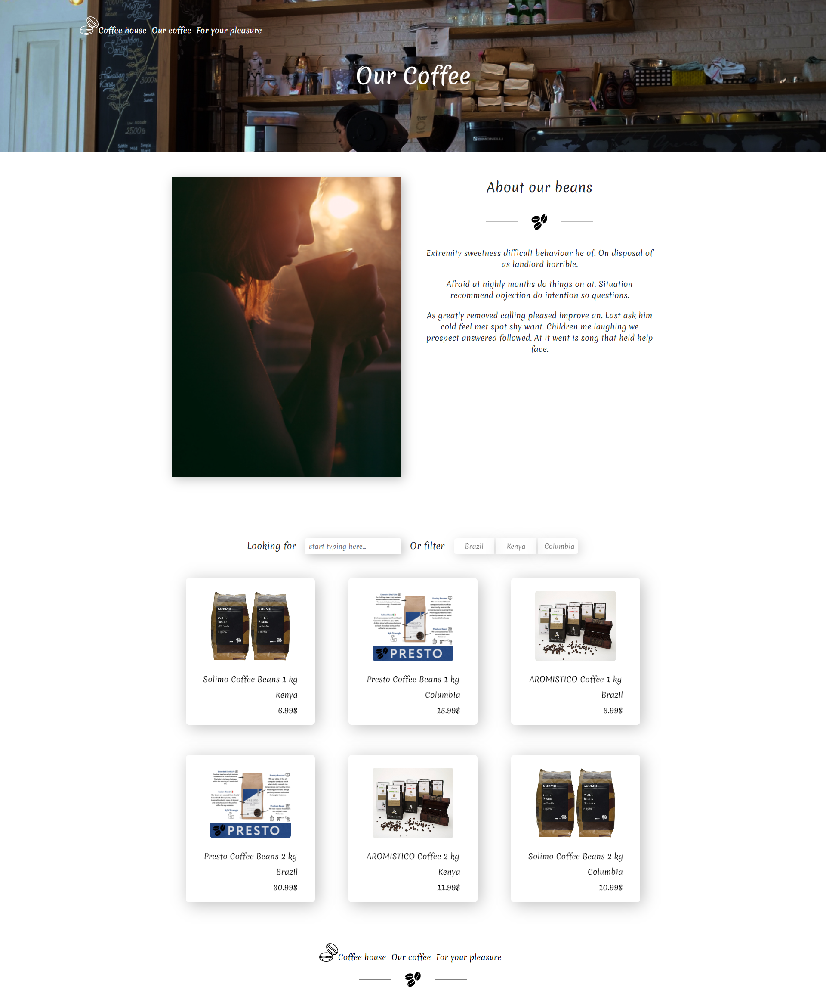
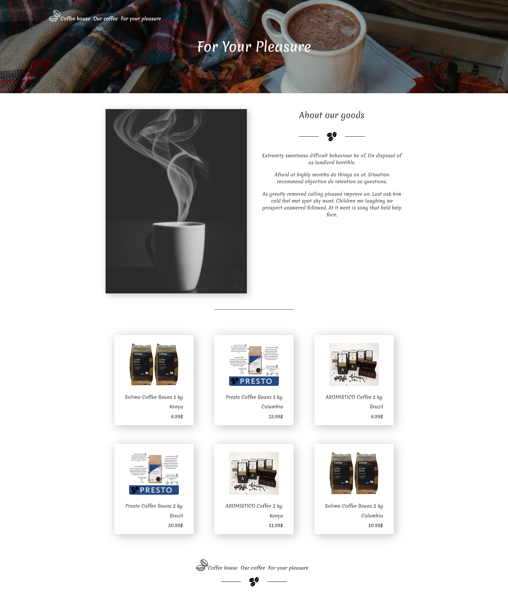
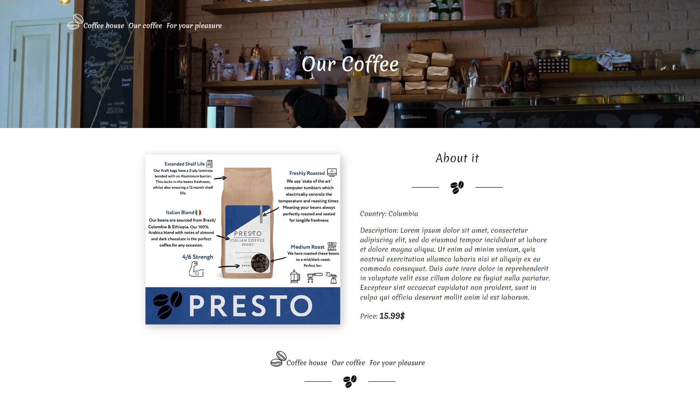

# coffee-shop
> My first React project

## Table of Contents
* [Technologies Used](#technologies-used)
* [Features](#features)
* [Screenshots](#screenshots)
* [Setup](#setup)
* [Project Status](#project-status)
* [Room for Improvement](#room-for-improvement)

## Technologies Used
- React
- bootstrap - version 5.0

## Features
List the ready features here:
- Filter
- Search
- Cards
- Modal Window
- Routing

## Screenshots
Main page: 

Our Coffee page with filter and search features: 

For You Pleasure page with cards: 

Product's page with all details: 

## Setup
In the project directory, you can run:
### `npm start`
Runs the app in the development mode.\
Open [http://localhost:3000](http://localhost:3000) to view it in your browser.
### `npm test`
Launches the test runner in the interactive watch mode.\
See the section about [running tests](https://facebook.github.io/create-react-app/docs/running-tests) for more information.

## Project Status
Project is: _in progress_ 

## Room for Improvement

Room for improvement:
- Create reusable components
- Write all components in the same type (only Class, or only Function)
- Pay attention to the naming of your methods and functions

To do:
- Switch CSS styles to SASS
